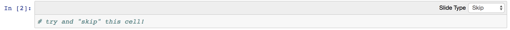

## Purpose
As you are creating a new Lecturer Facing Jupyter Notebook, make sure to assign cells that you want to show or hide accordingly using the "Slide Type" setting on each cell.

Ex:


If you do not see Slide Type on your cells, you can enable them by clicking on View -> Cell Toolbar -> Slideshow

## Usage
To use the script in this repo:
```
python script.py input_file.ipynb output_file.ipynb
```

Go ahead, try it with the `test.ipynb` file provided in this repo! :)
Try doing:
```
python script.py test.ipynb output.ipynb
```

After it runs, you will see a new Jupyter Notebook in your folder with all the cells that were marked as "Skip", removed! :ultrafastparrot:

## Update
I just added a new feature! Now you can add the `--notes` tag to the command to also delete cells that were marked as "Notes" as well as the default behavior of removing "Skip" cells.

Example usage:
```
python script.py test.ipynb output.ipynb --notes
```

Note: The `--notes` flag must be the third argument passed into the script.

Warning:
This is the first version of this script. Please give me feedback so I can improve upon it with future iterations! :)
